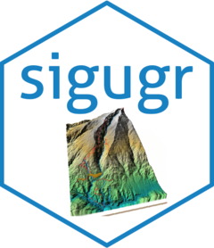

<!-- README.md is generated from README.Rmd. Please edit that file -->

```{r, include = FALSE}
knitr::opts_chunk$set(
  collapse = TRUE,
  comment = "#>",
  fig.path = "man/figures/README-",
  out.width = "100%"
)
```

# sigugr: Workflow for Geographic Data <a href="https://josesamos.github.io/sigugr/"></a>


<!-- badges: start -->
[](https://github.com/josesamos/sigugr/actions/workflows/R-CMD-check.yaml)
[](https://app.codecov.io/gh/josesamos/sigugr)
<!-- badges: end -->

The workflow for geographic data typically involves:  

- **Data acquisition**: Many datasets are sourced from web downloads.  
- **Data transformation**: This includes tasks such as raster composition, resolution adjustments, clipping, and style management.  
- **Data storage**: Storing the processed data in databases, such as PostGIS.  
- **Data publication**: Making the data accessible via platforms like GeoServer.  

The goal of the `sigugr` package is to provide a comprehensive set of functions that simplify the processes of transforming, storing, and publishing geographic data.

## Installation

You can install the development version of sigugr from [GitHub](https://github.com/) with:

``` r
# install.packages("pak")
pak::pak("josesamos/sigugr")
```

## Example

This is a basic example which shows you how to solve a common problem:

```{r example}
library(sigugr)
## basic example code
```

