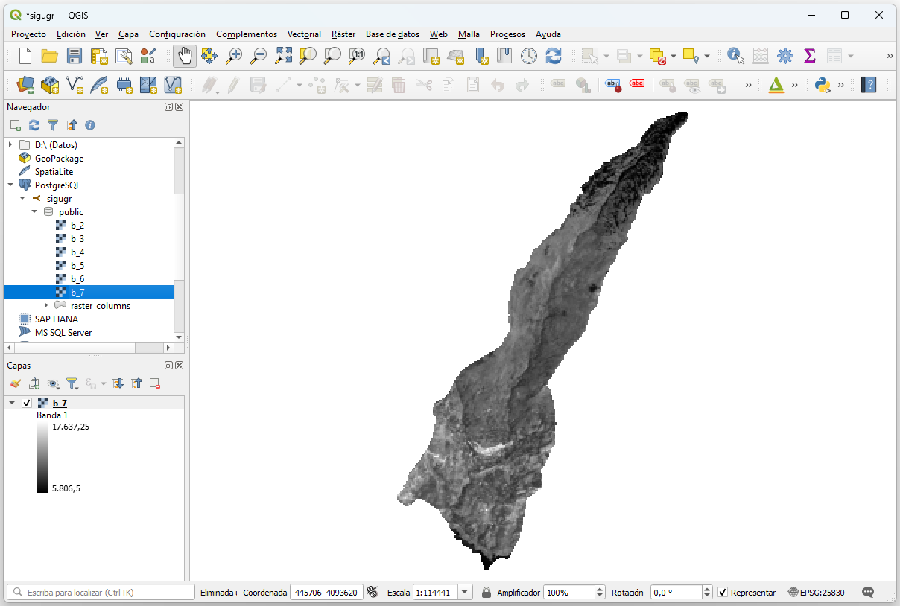
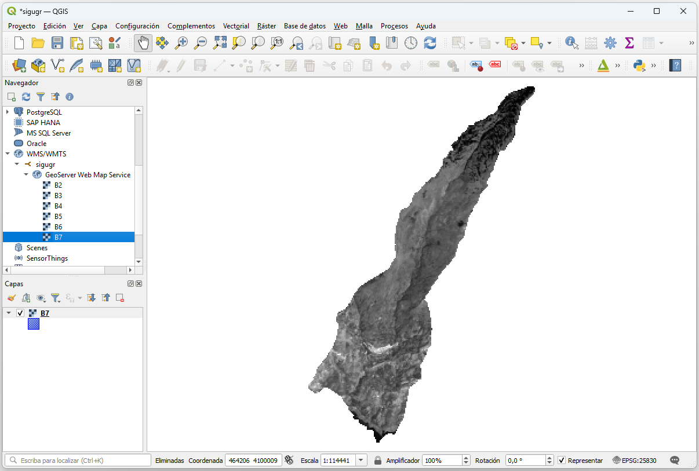

<!-- README.md is generated from README.Rmd. Please edit that file -->

```{r, include = FALSE}
knitr::opts_chunk$set(
  collapse = TRUE,
  comment = "#>",
  fig.path = "man/figures/README-",
  out.width = "100%"
)
```

# sigugr: Workflow for Geographic Data <a href="https://josesamos.github.io/sigugr/"></a>


<!-- badges: start -->
[](https://github.com/josesamos/sigugr/actions/workflows/R-CMD-check.yaml)
[](https://app.codecov.io/gh/josesamos/sigugr)
<!-- badges: end -->

The workflow for geographic data typically involves:  

- Data acquisition: Many datasets are sourced from web downloads.  
- Data transformation: This includes tasks such as raster composition, resolution adjustments, clipping, reprojection, and style management.  
- Data storage: Storing the processed data in databases, such as PostGIS.  
- Data publication: Making the data accessible via platforms like GeoServer.  

The goal of the `sigugr` package is to provide a comprehensive set of functions that simplify the processes of transforming, storing, and publishing geographic data.


## Installation

You can install the development version of sigugr from [GitHub](https://github.com/) with:

``` r
# install.packages("pak")
pak::pak("josesamos/sigugr")
```

## Example

The satellite bands for a specific area were downloaded from [*GloVis*](https://glovis.usgs.gov/app?fullscreen=0) (*USGS Global Visualization Viewer*). They were integrated and initially transformed using the [`satres`](https://CRAN.R-project.org/package=satres) package. To reduce their file size and enable inclusion here, their resolution was adjusted using the `aggregate_rasters()` function provided by this package.

Figure 1 below shows the original satellite bands that we started with.

```{r web-usgs01, fig.width=10, fig.height=7, dpi=300, out.width="80%", fig.align='center', fig.cap = "Figure 1: Original satellite bands."}
library(sigugr)

tif <- system.file("extdata", "sat.tif", package = "sigugr")
sat <- terra::rast(tif)
terra::plot(sat)
```

We are interested only in the area defined by a polygon representing a municipality in the region. Using the `clip_raster()` function, we extract the area of interest. We can either preserve the original CRS of the bands or reproject them to the CRS of the clipping polygon, which is controlled by the `keep_crs` parameter.

The obtained result is shown in Figure 2.

```{r clip, fig.width=10, fig.height=7, dpi=300, out.width="80%", fig.align='center', fig.cap = "Figure 2: Satellite bands cut by a polygon."}
gpkg <- system.file("extdata", "sigugr.gpkg", package = "sigugr")
polygon <- sf::st_read(gpkg, layer = "lanjaron", quiet = TRUE)

sat2 <- clip_raster(sat, polygon, keep_crs = FALSE)

terra::plot(sat2)
```

We save the result in a working file, which will be used for database storage and publication.

```{r save}
sat_file <- tempfile(fileext = ".tif")
terra::writeRaster(sat2, sat_file, filetype = "GTiff", overwrite = TRUE)
```

We store the result in a PostGIS database using the `store_raster()` function. The database must have the `postgis` and `postgis_raster` extensions enabled.

```{r postgis, eval=FALSE}
conn <- DBI::dbConnect(
  RPostgres::Postgres(),
  dbname = "sigugr",
  host = "localhost",
  user = "postgres",
  password = "postgres"
)

tables <- store_bands(sat_file, conn)

DBI::dbDisconnect(conn)
```

The following Figure 3 shows the access from QGIS to one of the tables included in the database.

```{r, echo=FALSE, fig.align='center', fig.cap="Figure 3: Accessing PostGIS from QGIS."}

```

To publish the raster bands in GeoServer, we must use the version stored in the file, as GeoServer does not support PostGIS as a source for raster data. We publish them using the `publish_raster()` function.

```{r geoserver, eval=FALSE}
gso <- geoserver(
  url = "http://localhost:8080/geoserver",
  user = "admin",
  password = "geoserver",
  workspace = "sigugr"
)

gso |>
  publish_bands(sat_file)
```

The result can also be viewed from QGIS by accessing the GeoServer instance via WMS, as shown in Figure 4.

```{r, echo=FALSE, fig.align='center', fig.cap="Figure 4: Accessing GeoServer from QGIS."}

```

Except for the functions used to connect to PostGIS and GeoServer, as well as those for accessing layers in files, the following function calls have been used to clip and reproject the satellite bands, store them in PostGIS, and publish them in GeoServer:

```{r all, eval=FALSE}
# Clip and reproject
sat2 <- clip_raster(sat, polygon, keep_crs = FALSE)

# Store in PostGIS
tables <- store_bands(sat_file, conn)

# Publish in GeoServer
gso |>
  publish_bands(sat_file)
```

Using data obtained from the web, we can easily transform, store, and publish it using the functions implemented in the package, as demonstrated in this example.

